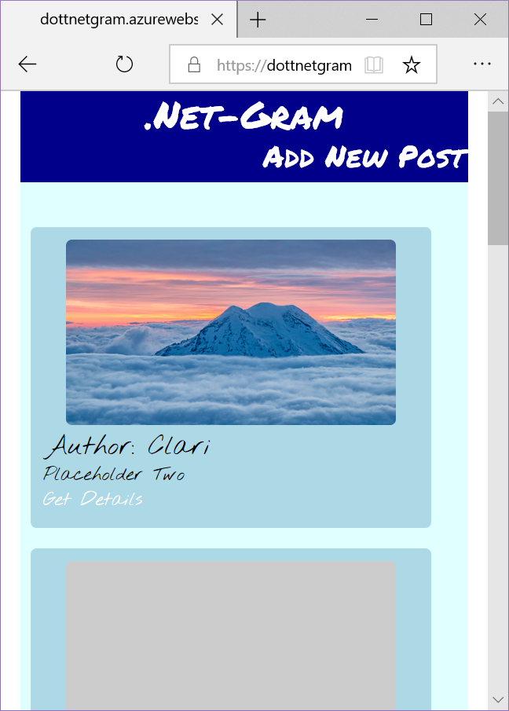
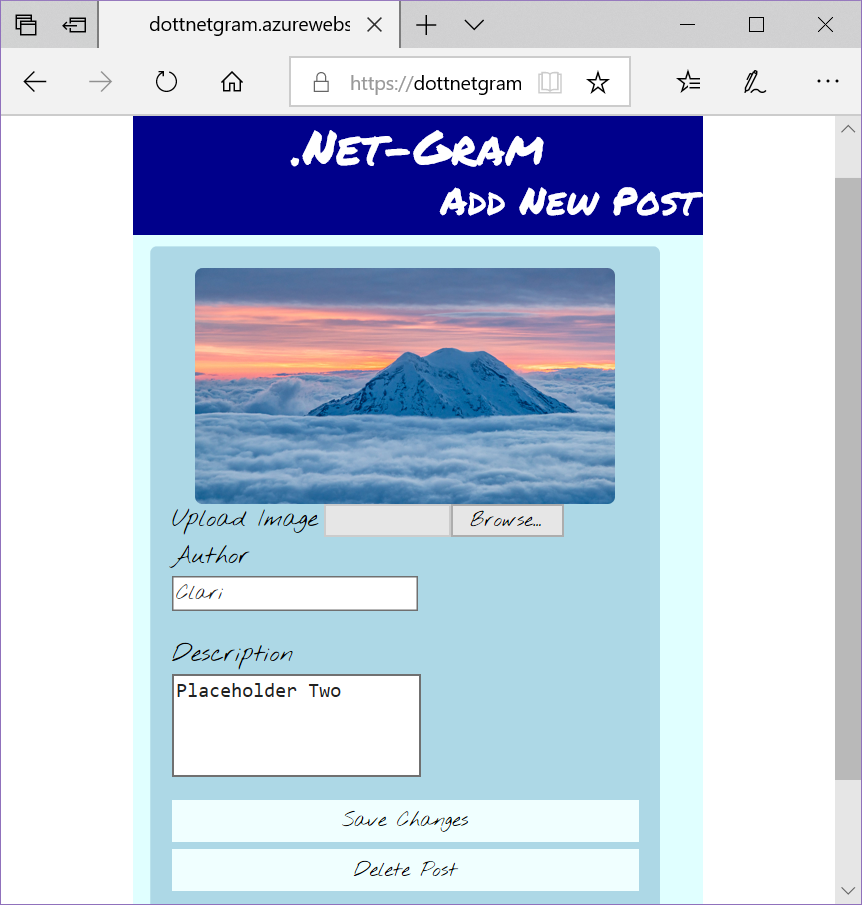
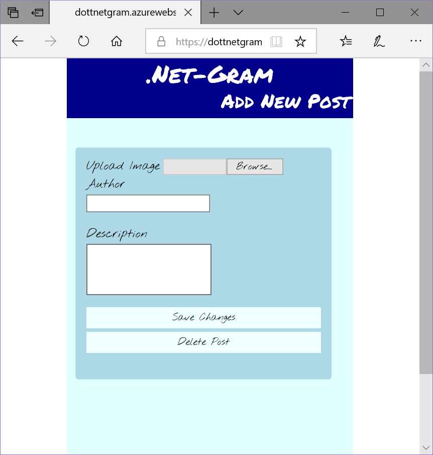
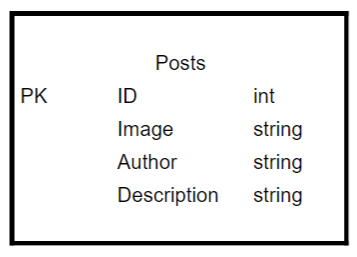

# asp.NET-Gram
Utilizing  SQL Database and Blob Storage, upload images with an author and a description. Scroll through images with the ability add, edit, view and delete posts.

## Deployment 
;

## Instructions
- To Create A New Post
	- Select Link "Add New Post"
	- Upload an Image
	- Add your name
	- Add a Description
	- Select Save
- View Details
	- Select "Details" On your selected post
- Edit A Post
	- Select Details on the post you wish to edit
	- Select Edit 
	- upload an Image, or change the text in the author or description box.
	- Select Save
- Delete A Post
	- Select Details on the post you wish to Delete
	- Select Edit
	- Select the Delete Button

## Sample Views

## Technologies Used
- Languages
	- C#
	- HTML
	- CSS
- Architectures and Frameworks
	- ASP.net
	- Razor Pages
- Tools
	- Azure 
	- Git
	- GitHub

## Architectural Design

The Post table has a primary key ID which is an integer. It also has properties Description, Author and Image that are all strings.

